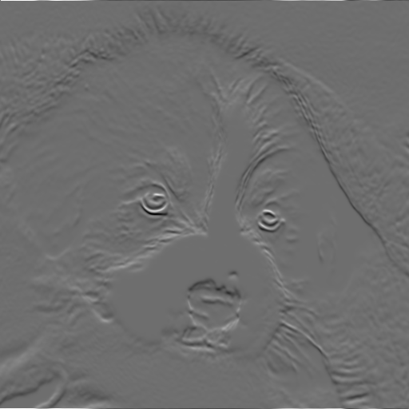

# 2D-Neural-Fields-Rendering
Image Neural Rendering using Neural Fields

## Reference Paper
I've shared on my LinkedIn page: https://www.linkedin.com/posts/diego-bonilla-salvador_neural-fields-in-visual-computing-and-beyond-activity-6921383863910862848-9pTi?utm_source=linkedin_share&utm_medium=member_desktop_web

## Results

## Derivation
One can calculate the derivate of the color in respect of the input position to measure the changes. It can be only done with Black and White images.

## TO-DO
- Transform input coordinates using a positional embedding.
